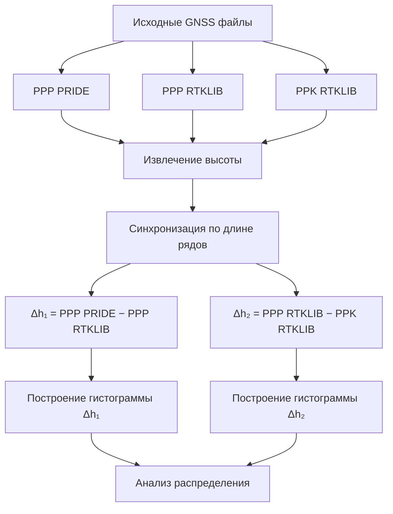

---
## 📌 Назначение проекта

Данный проект предназначен для **сравнительного анализа точности определения высоты по данным GNSS** с использованием:

* метода **PPP (Precise Point Positioning)**
* метода **PPK (Post-Processed Kinematic)**
* программных пакетов **PRIDE** и **RTKLIB**

Анализ выполняется **исключительно на основе разностей высот**, что соответствует общепринятой методологии оценки точности GNSS-решений и требованиям к научным и выпускным квалификационным работам.

---

## 📂 Используемые входные данные

В работе используются следующие файлы:

* `ppp_pride` — PPP-решение, полученное в программном пакете **PRIDE**
* `ppp_rtklib.pos` — PPP-решение, полученное в **RTKLIB**
* `ppk_rtklib.pos` — PPK-решение, полученное в **RTKLIB**

> PPK-решение, полученное в PRIDE, в рамках данной работы отсутствует, что явно указано и учтено при формировании области исследования.

---

## 🎯 Цель анализа

Целью является **оценка расхождений в определении высоты**:

1. между программными пакетами при использовании метода PPP
2. между методами PPP и PPK в рамках одного программного пакета (RTKLIB)

Абсолютные значения высоты **не анализируются**, так как они зависят от системы координат и не отражают точность решения.

---

## 📊 Рассчитываемые величины

В рамках работы вычисляются следующие разности высот:

* **Δh₁ = PPP(PRIDE) − PPP(RTKLIB)**
* **Δh₂ = PPP(RTKLIB) − PPK(RTKLIB)**

Именно эти величины используются для построения гистограмм и последующего анализа.

---

## 📈 Результаты обработки

В результате работы скрипта формируются следующие графики:

* `hist_ppp_pride_vs_rtklib.png` — гистограмма разностей высот PPP(PRIDE) и PPP(RTKLIB)
* `hist_ppp_vs_ppk_rtklib.png` — гистограмма разностей высот PPP и PPK в RTKLIB

Гистограммы отражают распределение ошибок и позволяют оценить:

* разброс решений
* наличие смещения
* относительную точность методов

---

## ▶️ Запуск обработки

1. Установить зависимости:

```bash
pip install pandas matplotlib
```

2. Запустить скрипт:

```bash
python3 height_histograms.py
```

После выполнения в рабочей директории будут сохранены PNG-файлы с гистограммами.

---

## 🧠 Методологические замечания

* Анализ абсолютных высот **не проводится**, так как он не позволяет оценить точность GNSS-решений.
* Использование разностей высот является стандартным подходом в GNSS-исследованиях.
* Полученные результаты могут быть использованы в выпускной квалификационной работе (дипломе).

---

## 🎓 Применение результатов

Результаты могут быть использованы:

* в дипломной работе
* при сравнительном анализе GNSS-методов
* для оценки качества PPP и PPK решений
* в учебных и научных целях

---

# 🧩 Алгоритм обработки (Mermaid)



---

## ✅ Итог

Проект реализует корректный и методологически обоснованный подход к анализу GNSS-решений, соответствующий требованиям к дипломным работам технического профиля.

---

