# 📘 README

## 📌 Описание проекта

Данный репозиторий содержит программный код и результаты обработки данных, выполненные в рамках **выпускной квалификационной работы (диплома)**.

Работа посвящена **сравнительному анализу точности определения высоты по данным GNSS** с использованием методов:

- **PPP (Precise Point Positioning)**
- **PPK (Post-Processed Kinematic)**

и программных пакетов:

- **PRIDE**
- **RTKLIB**

Анализ выполнен в соответствии с общепринятой методологией GNSS-исследований и ориентирован на оценку **разностей высот**, а не абсолютных значений.

---

## 📂 Входные данные

В работе используются следующие файлы с результатами GNSS-обработки:

- `ppp_pride` — PPP-решение, полученное в программном пакете **PRIDE**
- `ppp_rtklib.pos` — PPP-решение, полученное в **RTKLIB**
- `ppk_rtklib.pos` — PPK-решение, полученное в **RTKLIB**

> PPK-решение, полученное в программном пакете PRIDE, в рамках данной работы отсутствует, что учитывается при формировании области исследования.

---

## 🎯 Цель работы

Целью работы является **оценка расхождений в определении высоты**:

1. между программными пакетами при использовании метода PPP  
2. между методами PPP и PPK в рамках одного программного пакета (RTKLIB)

Абсолютные значения высоты **не анализируются**, поскольку они зависят от системы координат и не отражают точность позиционирования.

---

## 📊 Методика обработки

В рамках анализа вычисляются следующие разности высот:

- **Δh₁ = PPP(PRIDE) − PPP(RTKLIB)**
- **Δh₂ = PPP(RTKLIB) − PPK(RTKLIB)**

Для полученных разностей строятся гистограммы распределения, позволяющие оценить разброс решений и характер ошибок.

---

## 📈 Результаты

В результате выполнения программы формируются следующие графики:

- `hist_ppp_pride_vs_rtklib.png` — гистограмма разностей высот PPP(PRIDE) и PPP(RTKLIB)
- `hist_ppp_vs_ppk_rtklib.png` — гистограмма разностей высот PPP и PPK в RTKLIB

Гистограммы используются для визуальной оценки точности и стабильности решений.

---

## ▶️ 1. Запуск программы

### Установка зависимостей
```bash
pip install pandas matplotlib
```

## ▶️ 2. Запустить скрипт:

```bash
python3 height_histograms.py
```

---

## 🧩 Алгоритм обработки (Mermaid)

```mermaid
flowchart TD
    A[Исходные GNSS файлы] --> B[PPP PRIDE]
    A --> C[PPP RTKLIB]
    A --> D[PPK RTKLIB]

    B --> E[Извлечение высоты]
    C --> E
    D --> E

    E --> F[Синхронизация по длине рядов]

    F --> G[Δh₁ = PPP PRIDE − PPP RTKLIB]
    F --> H[Δh₂ = PPP RTKLIB − PPK RTKLIB]

    G --> I[Построение гистограммы Δh₁]
    H --> J[Построение гистограммы Δh₂]

    I --> K[Анализ распределения]
    J --> K
```



---
